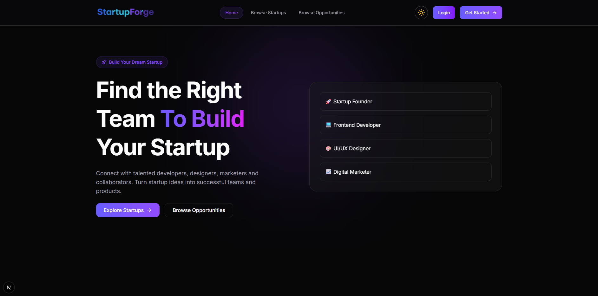

# StartupForge - Startup Team Builder Platform



## 🚀 Live Demo

**Live Website:** https://startupforge-platform.vercel.app/

## 📖 About StartupForge

StartupForge is a modern startup collaboration platform designed to connect startup founders with talented collaborators. Founders can create startup profiles, post opportunities, and build their dream teams, while collaborators can discover startups, apply for opportunities, and contribute to innovative projects.

The platform bridges the gap between startup founders and skilled professionals, making it easier to build and grow successful startup teams.

---

## ✨ Key Features

### 👨‍💼 Founder Features

- Create and manage startup profiles
- Post startup opportunities
- Review collaborator applications
- Accept or reject applications
- Opportunity posting limits based on subscription plan
- Manage startup information and opportunities
- Premium plan support

### 👨‍💻 Collaborator Features

- Browse available startups
- Discover opportunities
- Apply to startup opportunities
- Track application status
- Manage personal profile
- Portfolio integration
- Application limits based on subscription plan
- Premium plan support

### 🛡️ Admin Features

- Dashboard analytics
- Manage users
- Block and unblock users
- Manage startups
- Approve startups
- Reject startups
- Delete startups
- View transactions
- Monitor platform revenue
- Platform statistics and charts

### 💳 Subscription & Payments

- Stripe Payment Integration
- Premium Plan Upgrades
- Founder Premium Plan
- Collaborator Premium Plan
- Transaction Tracking
- Revenue Analytics

### 🔐 Security Features

- Better Auth Authentication
- Google Login
- Protected Routes
- Role-Based Access Control (RBAC)
- Blocked Account Protection
- Unauthorized Access Handling
- Server-Side Authorization
- Error Boundaries

### 📊 Dashboard Features

- Interactive Statistics Cards
- Revenue Charts
- Platform Analytics
- Application Tracking
- Opportunity Tracking
- Startup Performance Insights

---

## 🛠️ Technologies Used

### Frontend

- Next.js 16
- React 19
- Tailwind CSS v4
- HeroUI v3
- Framer Motion
- Lucide React
- Recharts

### Backend

- Node.js
- Express.js
- MongoDB

### Authentication

- Better Auth
- Google OAuth

### Payment

- Stripe

### Deployment

- Vercel (Client)
- Vercel / Node Server (Backend)

---

## 📂 Project Structure

```bash
src
├── app
│   ├── (public-routes)
│   ├── dashboard
│   │   ├── admin
│   │   ├── founder
│   │   └── collaborator
│   ├── pricing
│   ├── success
│   ├── unauthorized
│   ├── account-blocked
│   ├── not-found
│   └── api
│
├── components
│   ├── dashboard
│   ├── shared
│   ├── navbar
│   ├── footer
│   ├── charts
│   └── ui
│
├── lib
│   ├── actions
│   ├── fetchings
│   ├── core
│   ├── auth
│   └── stripe
│
├── providers
├── hooks
└── UI
```

---

## 🔑 Environment Variables

Create a `.env.local` file in the root directory and add the following variables:

```env
BETTER_AUTH_SECRET=
BETTER_AUTH_URL=

NEXT_PUBLIC_BASE_URL=
NEXT_PUBLIC_BASE_API_URL=

MONGO_DB_URI=

GOOGLE_CLIENT_ID=
GOOGLE_CLIENT_SECRET=

NEXT_PUBLIC_IMGBB_API_KEY=

NEXT_PUBLIC_STRIPE_PUBLISHABLE_KEY=
STRIPE_SECRET_KEY=
```

---

## ⚙️ Installation

### Clone Client Repository

```bash
git clone https://github.com/tawhidzihad/startupforge-client.git
```

### Install Dependencies

```bash
npm install
```

### Run Development Server

```bash
npm run dev
```

---

## 🔗 Repositories

### Client Repository

https://github.com/tawhidzihad/startupforge-client

### Server Repository

https://github.com/tawhidzihad/startupforge-server

---

## 👤 User Roles

### Founder

Can create startups, post opportunities, manage applications, and build teams.

### Collaborator

Can browse startups, apply to opportunities, and manage applications.

### Admin

Can manage users, startups, transactions, and platform operations.

---

## 💎 Subscription Plans

### Free Plan

- Up to 3 Applications (Collaborator)
- Up to 3 Opportunities (Founder)

### Premium Plan ($99.99)

- Up to 100 Applications
- Up to 100 Opportunities
- Premium Badge
- Priority Visibility
- Additional Platform Benefits

---

## 📈 Platform Highlights

- Startup Discovery
- Team Building
- Opportunity Management
- Application Tracking
- Subscription Management
- Revenue Analytics
- Role-Based Dashboards
- Responsive Design
- Dark Mode Support

---

## 🤝 Contributing

Contributions, issues, and feature requests are welcome.

Feel free to fork the repository and submit a pull request.

---

## 📜 License

This project is developed for educational and portfolio purposes.

---

### Developed By

**Md Tawhidul Islam Zihad**
MERN Stack Developer

Building innovative web applications with React, Next.js, Node.js, and MongoDB.
